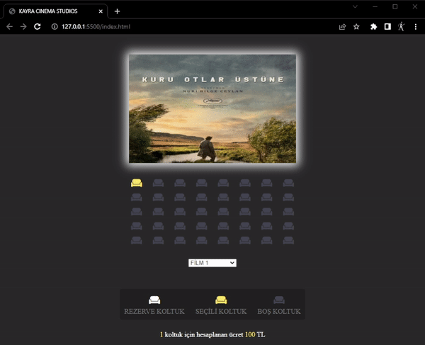

# Movie Ticket Reservation JS Project

 Bu projemizde öncelikle HTML ve CSS yardımıyla nesnelerimizi hizaladık. Yapılan her koltuk seçiminin sayfa yenilendiğinde sabit kalmasını sağladık. Bunu, tarayıcımızın Local Storage bölümünü kullanarak gerçekleştirdik. 

 Javascript yeteneklerinden faydalanarak  her film için ayrı fiyat tanımlaması yapabildik.

 Proje Görüntüsü 

 ---------   ---------   ---------

 In this project, we first aligned our objects using HTML and CSS. We ensured that each seat selection remains persistent when the page is refreshed. We accomplished this using the Local Storage section of our browser.

 By leveraging JavaScript capabilities, we were able to define separate prices for each movie.

 Project Preview 

